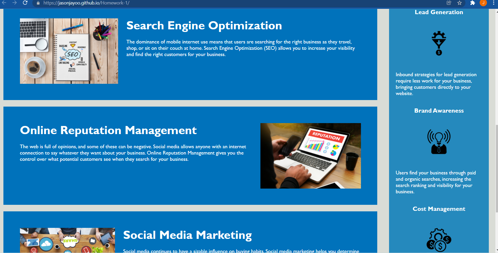
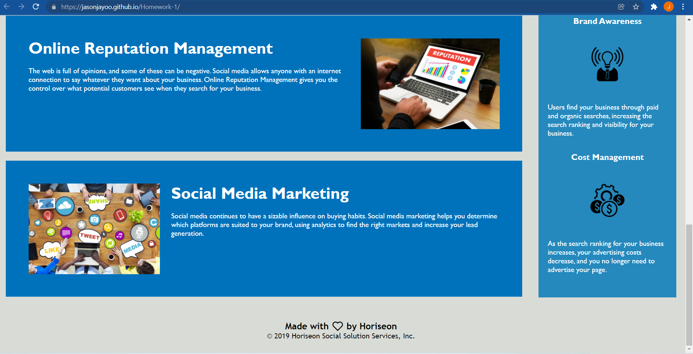

# The-Horiseon-Project

(Homework-1: Refactoring)

 

## Project Details: 

On-the-job ticket scenario where another developers work has to be corrected and syntax/notes added. The clients/company the website is for is called "Horiseon" all images and links have to work correctly and the information/text look professional.

 

### HTML - Details of work completed in order:

1. Began by setting the style.css href to link correctly with the index.html file.
2. Placed (header) tag between (body) tag and above (hero) tag.
3. Removed </> closing from image tags.
4. Added (alt) to all images for ADA compliance (add title as well just in case).
5. Modified href links for each image to link correctly with new image folder.
6. Added spacing between (tags) to clean up the code for easier readability, comprehension, and collaboration.
7. Change footer h2 to h4 in order to have all the (h#) in sequential order. (ref css - text font size specification noted)
8. Added Comments/Notes Detailing each line of code and what it is for.
9. Added alt="her" to div class hero for ADA compliance and for google's love.
10. Added  alt="Horiseon" title="Horiseon" in seo span under class=header for ADA compliance and for the love of google.

 

### CSS - Details of work completed in order:

1. Moved (search engine optimization all the way through social media marketing h2) selectors and place them between the Float-right selector and the content selector so that the selectors are placed in the same order of the html file tags for easier reference. 
2. Consolidated classes: search-engine-optimization, online-reputation-management, and social-media-marketing under main-content class to clean    up/ remove repetative codes.
3. Consolidated classes: search-engine-optimization img, online-reputation-management img, and social-media-marketing img under main-image class to clean up/repetative codes.
4. Consolidated classes: search-engine-optimization h2, online-reputation-management h2 , and social-media-marketing h2 under main-content h2 class to clean up/repetative codes 
6. Consolidated classes: benefit-lead, benefit-brand, benefit-cost,  benefit-lead img, benefit-brand img, benefit-cost img , benefit-lead h3, benefit-brand h3 , benefit-cost, all under div class sidebox-bar cleaned up/removed repetative codes
7. Modified class hero (.hero) url to correctly link image to new image folder
8. Added Comments/Notes Detailing each line of code and what it is for.

 

### Screenshots: (Highlighted Title(s) = a hyperlink to the direct image)

 

[Screenshot1](images/Screenshot1.png)

[Screenshot2](images/Screenshot2.png)

[Screenshot3](images/Screenshot3.png)

 

#### URL (Github Repository):

Click [here](https://github.com/jasonjayoo/The-Horiseon-Project) to go to The-Horiseon-Project Github Repository

 

#### URL (Published Webpage):

<a href="https://jasonjayoo.github.io/The-Horiseon-Project/" target="_blank">The-Horiseon-Project</a>

